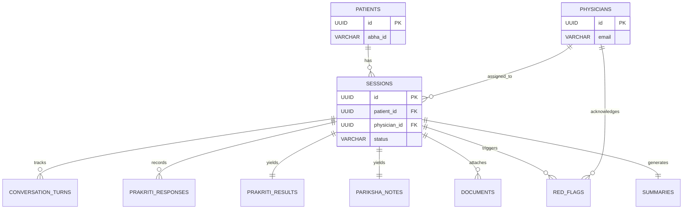

# Database Schema

This document outlines the PostgreSQL schema for the AYUSH-Care / MediKiosk Supabase backend. All tables, columns, types, constraints, and foreign keys are included.

## Tables

### 1. patients
```sql
CREATE TABLE patients (
  id UUID PRIMARY KEY DEFAULT gen_random_uuid(),
  abha_id VARCHAR(20) UNIQUE,          -- ABHA health ID (nullable for manual registration)
  aadhaar_last_four CHAR(4),           -- last 4 digits only, never store full Aadhaar
  full_name VARCHAR(200) NOT NULL,
  age INTEGER NOT NULL CHECK (age > 0 AND age < 150),
  gender VARCHAR(20) NOT NULL CHECK (gender IN ('male', 'female', 'other')),
  phone VARCHAR(15),
  language_preference VARCHAR(10) DEFAULT 'hi',
  created_at TIMESTAMPTZ DEFAULT now(),
  updated_at TIMESTAMPTZ DEFAULT now()
);
```

### 2. physicians
```sql
-- Authenticated via Supabase Auth. This table holds profile data.
CREATE TABLE physicians (
  id UUID PRIMARY KEY REFERENCES auth.users(id),
  full_name VARCHAR(200) NOT NULL,
  email VARCHAR(255) UNIQUE NOT NULL,
  department VARCHAR(100) NOT NULL DEFAULT 'Ayurveda',
  designation VARCHAR(100),
  created_at TIMESTAMPTZ DEFAULT now()
);
```

### 3. sessions
```sql
CREATE TYPE session_status AS ENUM ('in_progress', 'awaiting_review', 'reviewed', 'completed');

CREATE TABLE sessions (
  id UUID PRIMARY KEY DEFAULT gen_random_uuid(),
  patient_id UUID NOT NULL REFERENCES patients(id) ON DELETE CASCADE,
  physician_id UUID REFERENCES physicians(id),
  language VARCHAR(10) DEFAULT 'hi',
  chief_complaint TEXT,
  status session_status DEFAULT 'in_progress',
  red_flag_triggered BOOLEAN DEFAULT false,
  consent_granted BOOLEAN DEFAULT false,
  consent_timestamp TIMESTAMPTZ,
  current_step VARCHAR(50) DEFAULT 'idle',
  created_at TIMESTAMPTZ DEFAULT now(),
  completed_at TIMESTAMPTZ
);
```

### 4. conversation_turns
```sql
CREATE TYPE speaker_type AS ENUM ('system', 'patient');
CREATE TYPE input_mode_type AS ENUM ('voice', 'touch', 'text');

CREATE TABLE conversation_turns (
  id UUID PRIMARY KEY DEFAULT gen_random_uuid(),
  session_id UUID NOT NULL REFERENCES sessions(id) ON DELETE CASCADE,
  turn_index INTEGER NOT NULL,
  speaker speaker_type NOT NULL,
  message_text TEXT NOT NULL,
  input_mode input_mode_type,
  created_at TIMESTAMPTZ DEFAULT now()
);
```

### 5. prakriti_responses
```sql
CREATE TYPE dosha_type AS ENUM ('vata', 'pitta', 'kapha');

CREATE TABLE prakriti_responses (
  id UUID PRIMARY KEY DEFAULT gen_random_uuid(),
  session_id UUID NOT NULL REFERENCES sessions(id) ON DELETE CASCADE,
  question_id VARCHAR(50) NOT NULL,
  question_text TEXT NOT NULL,
  selected_option TEXT NOT NULL,
  dosha_tag dosha_type NOT NULL,
  points INTEGER DEFAULT 1,
  created_at TIMESTAMPTZ DEFAULT now()
);
```

### 6. prakriti_results
```sql
CREATE TYPE confidence_level AS ENUM ('low', 'medium', 'high');

CREATE TABLE prakriti_results (
  id UUID PRIMARY KEY DEFAULT gen_random_uuid(),
  session_id UUID NOT NULL UNIQUE REFERENCES sessions(id) ON DELETE CASCADE,
  vata_score INTEGER NOT NULL,
  pitta_score INTEGER NOT NULL,
  kapha_score INTEGER NOT NULL,
  total_questions INTEGER DEFAULT 15,
  dominant_prakriti VARCHAR(50) NOT NULL,
  secondary_prakriti VARCHAR(50),
  confidence confidence_level NOT NULL,
  created_at TIMESTAMPTZ DEFAULT now()
);
```

### 7. pariksha_notes
```sql
CREATE TABLE pariksha_notes (
  id UUID PRIMARY KEY DEFAULT gen_random_uuid(),
  session_id UUID NOT NULL UNIQUE REFERENCES sessions(id) ON DELETE CASCADE,
  vikriti TEXT,
  sara TEXT,
  samhanana TEXT,
  pramana TEXT,
  satmya TEXT,
  satva TEXT,
  ahara_shakti TEXT,
  vyayama_shakti TEXT,
  vaya INTEGER,
  created_at TIMESTAMPTZ DEFAULT now()
);
```

### 8. documents
```sql
CREATE TYPE doc_type AS ENUM ('prescription', 'lab_report', 'discharge_summary', 'other');
CREATE TYPE process_status AS ENUM ('pending', 'processing', 'completed', 'failed');

CREATE TABLE documents (
  id UUID PRIMARY KEY DEFAULT gen_random_uuid(),
  session_id UUID NOT NULL REFERENCES sessions(id) ON DELETE CASCADE,
  file_name VARCHAR(255) NOT NULL,
  file_url TEXT NOT NULL,
  file_type doc_type NOT NULL,
  extracted_text TEXT,
  structured_data JSONB,
  document_date DATE,
  confidence_score FLOAT,
  processing_status process_status DEFAULT 'completed',
  created_at TIMESTAMPTZ DEFAULT now()
);
```

### 9. red_flags
```sql
CREATE TYPE severity_level AS ENUM ('critical', 'high', 'moderate');

CREATE TABLE red_flags (
  id UUID PRIMARY KEY DEFAULT gen_random_uuid(),
  session_id UUID NOT NULL REFERENCES sessions(id) ON DELETE CASCADE,
  rule_id VARCHAR(50) NOT NULL,
  flag_description TEXT NOT NULL,
  triggered_symptoms TEXT[] NOT NULL,
  severity severity_level NOT NULL,
  acknowledged BOOLEAN DEFAULT false,
  acknowledged_by UUID REFERENCES physicians(id),
  acknowledged_at TIMESTAMPTZ,
  created_at TIMESTAMPTZ DEFAULT now()
);
```

### 10. summaries
```sql
CREATE TYPE phys_status AS ENUM ('pending', 'accepted', 'amended', 'rejected');

CREATE TABLE summaries (
  id UUID PRIMARY KEY DEFAULT gen_random_uuid(),
  session_id UUID NOT NULL UNIQUE REFERENCES sessions(id) ON DELETE CASCADE,
  generated_summary JSONB NOT NULL,
  raw_summary_text TEXT NOT NULL,
  patient_confirmed BOOLEAN DEFAULT false,
  patient_confirmed_at TIMESTAMPTZ,
  physician_edited_summary JSONB,
  physician_status phys_status DEFAULT 'pending',
  physician_notes TEXT,
  reviewed_at TIMESTAMPTZ,
  created_at TIMESTAMPTZ DEFAULT now(),
  updated_at TIMESTAMPTZ DEFAULT now()
);
```

## Indexes

```sql
CREATE INDEX idx_sessions_patient_id ON sessions(patient_id);
CREATE INDEX idx_sessions_physician_id ON sessions(physician_id);
CREATE INDEX idx_sessions_status ON sessions(status);
CREATE INDEX idx_sessions_created_at ON sessions(created_at);

CREATE INDEX idx_conversation_session ON conversation_turns(session_id);
CREATE INDEX idx_prakriti_res_session ON prakriti_responses(session_id);
CREATE INDEX idx_documents_session ON documents(session_id);
CREATE INDEX idx_red_flags_session ON red_flags(session_id);
```

## Row Level Security (RLS) Stubs

```sql
-- Example RLS setup for Supabase
ALTER TABLE patients ENABLE ROW LEVEL SECURITY;
ALTER TABLE sessions ENABLE ROW LEVEL SECURITY;
ALTER TABLE physicians ENABLE ROW LEVEL SECURITY;

-- Allow physicians to read their assigned sessions
CREATE POLICY "Physicians can view assigned sessions"
  ON sessions FOR SELECT
  USING (auth.uid() = physician_id OR status IN ('awaiting_review', 'in_progress'));

-- Allow public insertion for kiosk operations (anonymous usage until routed)
-- Depending on architecture, you might use a service role key for the backend.
```

## ER Diagram



## Supabase-Specific Notes

1. **Table Creation**: Execute these scripts in the Supabase SQL Editor. They can also be checked into version control as migration files using the Supabase CLI (`supabase migration new <name>`).
2. **Storage Bucket Setup**: You will need to create a storage bucket in Supabase called `patient-documents`. Set the bucket to Private, and manage access via the backend API.
3. **Auth Setup**: The `physicians` table uses the `auth.users` id as a foreign key. You must handle physician registration via Supabase Auth (e.g., email/password) and then trigger an insertion into the `physicians` table (via a trigger or backend logic) to hold the profile data.
