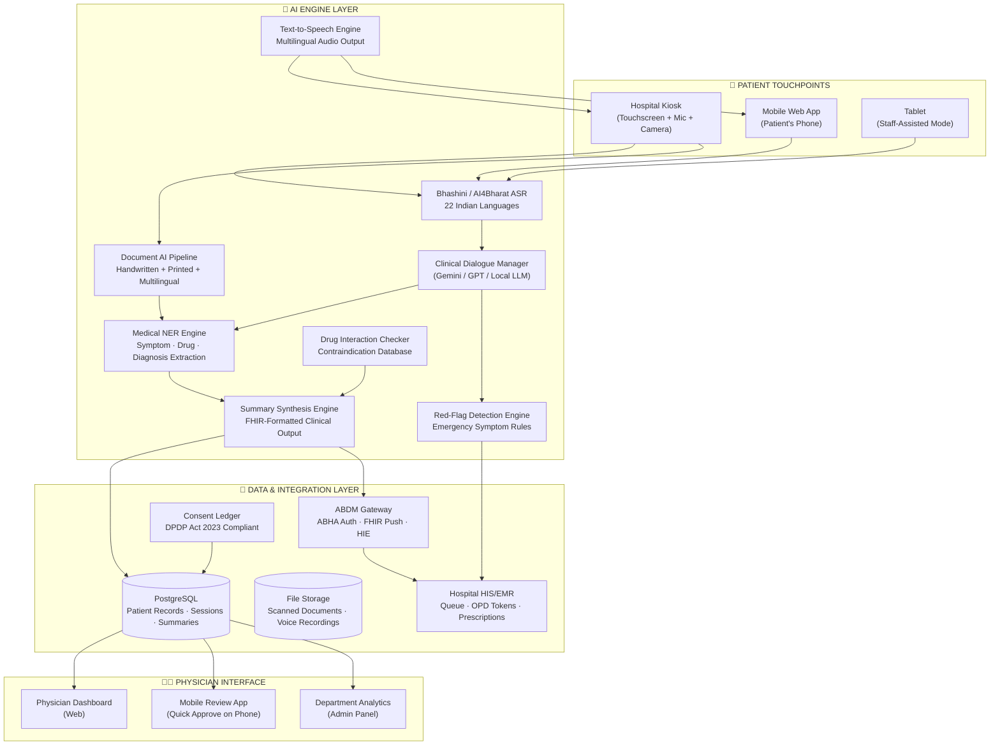
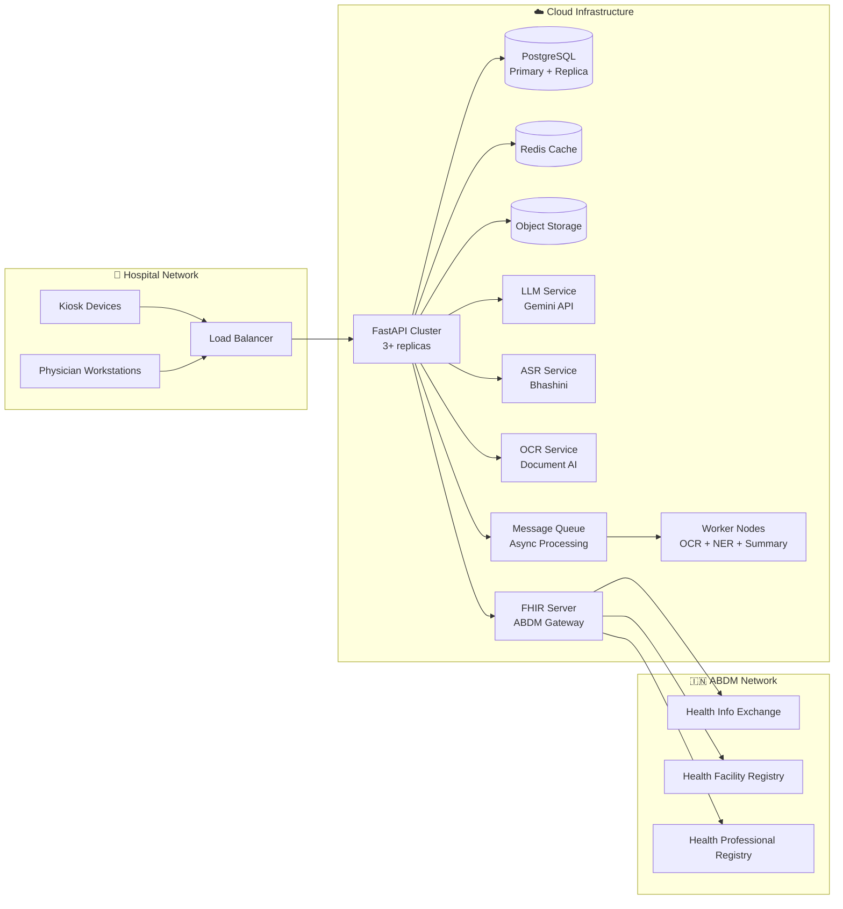

# MediKiosk — Full Production Vision

> The complete picture of what this system looks like when every module is built to its full depth, deployed across Indian hospitals, and integrated into the national health infrastructure.

---

## The One-Line Vision

**A patient walks into any government hospital in India, stands at a screen for 8–12 minutes, and walks into the doctor's room with a complete, structured, digitized medical history already on the physician's screen — in any Indian language, regardless of literacy level, with zero training required.**

---

## System Architecture — Full Version



---

## Module A — Conversational Multimodal History Engine (Full Version)

This is the core differentiator. In the full version, it becomes a complete AI clinical clerk.

### A1. Language & ASR (Full Depth)

| Feature | Description |
|---|---|
| **22 Indian Languages** | Hindi, English, Tamil, Telugu, Kannada, Malayalam, Bengali, Marathi, Gujarati, Punjabi, Odia, Assamese, Urdu, Maithili, Santali, Kashmiri, Nepali, Konkani, Dogri, Manipuri, Bodo, Sindhi — via Bhashini/AI4Bharat ASR models |
| **Accent Adaptation** | Regional accent handling — a Tamil patient speaking Hindi, a Bengali patient speaking English. ASR fine-tuned on hospital-environment audio (background noise, PA systems, crowd chatter) |
| **Code-Switching** | Patients naturally mix languages ("mujhe *headache* hai aur *chest mein pain* hota hai"). The ASR and NLU handle mid-sentence language switching without breaking |
| **Noise Cancellation** | Real-time audio preprocessing — adaptive noise gate, directional mic filtering for kiosk hardware. Reject ambient speech from adjacent patients |
| **Offline ASR Fallback** | On-device lightweight ASR model (Whisper-small or AI4Bharat compact) for when hospital WiFi drops. Lower accuracy but keeps the session alive |
| **Voice Biometrics (Stretch)** | Optional voiceprint matching for returning patients — "We recognize your voice from your last visit, welcome back" |

### A2. Clinical History Interview (Full Depth)

| Feature | Description |
|---|---|
| **SOCRATES Framework** | For every chief complaint, the system automatically branches into: **S**ite, **O**nset, **C**haracter, **R**adiation, **A**ssociations, **T**iming, **E**xacerbating/Relieving factors, **S**everity — mirroring how a physician thinks |
| **Full History of Present Illness (HPI)** | Not just chief complaint — captures timeline, progression, prior treatment attempts, and what brought them to the hospital today |
| **Past Medical & Surgical History** | "Have you been diagnosed with any long-term conditions?" → Diabetes, Hypertension, Thyroid, Asthma, TB, Cancer, Heart Disease, Kidney Disease with year-of-diagnosis capture |
| **Drug & Allergy History** | "What medications are you currently taking?" → Name, dose, frequency, duration. "Are you allergic to any medicines or foods?" → Specific reactions (rash, breathing difficulty, swelling) |
| **Family History** | "Does anyone in your close family have diabetes, heart disease, cancer, or other conditions?" → Maps to parents, siblings, children with condition type |
| **Personal & Social History** | Smoking (type/quantity/years), alcohol (type/quantity/frequency), tobacco chewing, diet (veg/non-veg/vegan), occupation, physical activity level, sleep pattern, stress level |
| **Review of Systems (ROS)** | Systematic organ-by-organ screening: cardiovascular (chest pain, palpitations, swelling), respiratory (cough, breathlessness, wheezing), GI (nausea, vomiting, bowel changes), neuro (headache, dizziness, numbness), musculoskeletal (joint pain, stiffness, swelling), urogenital, dermatological, endocrine, psychiatric — each triggered contextually based on chief complaint relevance |
| **Obstetric & Gynecological History** | For female patients: menstrual history (LMP, cycle regularity, flow), obstetric history (gravida, para, abortions, living children), contraceptive use, menopause status |
| **Pediatric Mode** | For children: birth history (term/preterm, mode of delivery, birth weight, NICU stay), immunization record, developmental milestones, feeding history, growth pattern — parent/guardian answers |
| **Geriatric Screening** | For elderly patients: falls history, mobility aids, activities of daily living (ADL) assessment, cognitive screening (orientation questions), polypharmacy review |
| **Contextual Depth Control** | The AI decides how deep to go based on the chief complaint. A patient with knee pain doesn't get 20 cardiovascular questions. A patient with chest pain gets deep cardio + respiratory but light musculoskeletal |

### A3. AYUSH History Mode (Full Depth — Dashavidha Pariksha)

This is what makes this solution uniquely valuable for AIIA and AYUSH hospitals.

| Parameter | Full Assessment |
|---|---|
| **1. Prakriti (Constitution)** | 25-question validated assessment (expanded from MVP's 15) covering Sharira (physical), Manasa (psychological), and Agni (metabolic) dimensions. Questions derived from Charaka Samhita Vimana Sthana Ch.8, Sushruta Samhita Sharira Sthana Ch.4, and Ashtanga Hridaya Sharira Sthana Ch.3. Outputs primary dosha, secondary dosha, and Prakriti subtype (e.g., Vata-Pitta with Vata dominant) |
| **2. Vikriti (Current Imbalance)** | 15-question assessment comparing current state to baseline Prakriti. Captures which dosha(s) are currently aggravated, the degree of vitiation (mild/moderate/severe), and the dhatu (tissue) level of disturbance. Critical for treatment planning |
| **3. Sara (Tissue Quality)** | Assessment of each of the 7 dhatus: Rasa (plasma), Rakta (blood), Mamsa (muscle), Meda (fat), Asthi (bone), Majja (marrow), Shukra (reproductive). Rated as Pravara (excellent), Madhyama (moderate), or Avara (poor) |
| **4. Samhanana (Body Compactness)** | Assessment of overall structural integrity — bone density, joint stability, muscle tone. Physical observation prompts with guided self-reporting |
| **5. Pramana (Body Proportions)** | Anthropometric data capture: height, weight, BMI, waist-hip ratio, limb proportions. Mapped to Ayurvedic body-type classifications |
| **6. Satmya (Adaptability)** | Assessment of patient's tolerance to changes in diet, climate, routine, and medications. Pravara Satmya (adapts to everything) vs. Avara Satmya (intolerant to change) — impacts treatment intensity recommendations |
| **7. Satva (Mental Resilience)** | 3-tier classification: Pravara (strong-willed, handles pain/stress calmly), Madhyama (moderate tolerance), Avara (low tolerance, easily disturbed). Impacts treatment compliance predictions |
| **8. Ahara Shakti (Digestive Capacity)** | Two components: Abhyavaharana Shakti (quantity of food intake capacity) and Jarana Shakti (speed/quality of digestion). Mapped to Agni types: Vishama (irregular), Tikshna (sharp/fast), Manda (slow/weak), Sama (balanced) |
| **9. Vyayama Shakti (Exercise Tolerance)** | Physical endurance assessment: how much exertion before fatigue, recovery time, cardiovascular stamina. Maps to treatment planning for Panchakarma suitability |
| **10. Vaya (Age Stage)** | Bala (childhood, 0-16), Madhyama (adulthood, 17-60, peak of all dhatus), Vriddha (elderly, 61+, progressive dhatu depletion). Impacts dosha expectations (Kapha dominant in Bala, Pitta in Madhyama, Vata in Vriddha) |

**Additional AYUSH Assessments:**

| Assessment | Description |
|---|---|
| **Ahara-Vihara (Diet & Lifestyle)** | Detailed dietary recall: meal times, food types (rasa/guna classification), water intake, food combinations (viruddha ahara detection). Lifestyle: wake time, sleep time, exercise, daily routine alignment with Dinacharya |
| **Nidana (Causative Factors)** | AI identifies potential hetu (causes) from the conversation: dietary triggers, lifestyle factors, emotional stressors, seasonal correlations, occupational hazards |
| **Samprapti (Pathogenesis Mapping)** | Based on all collected data, the system maps the disease progression pathway: Dosha vitiation → Dosha-Dushya Sammurchhana → Srotodushti → Sthanasamshraya → Vyakti. Presented as a visual flowchart for the physician |
| **Trividha Pariksha** | Darshana (inspection — via patient-uploaded photo), Sparshana (touch-based assessment — deferred to physician with guided prompts), Prashna (interrogation — covered by the conversational engine) |
| **Ashtavidha Pariksha** | Nadi (pulse — deferred to physician), Mutra (urine), Mala (stool), Jihva (tongue — photo upload with AI analysis), Shabda (voice quality — analyzed from audio), Sparsha (touch — deferred), Drik (eyes — photo upload), Akriti (overall appearance — photo upload) |

### A4. Red-Flag Detection (Full Version)

Not a simple keyword matcher — a clinical decision support system:

| Category | Rules |
|---|---|
| **Cardiac Emergencies** | Acute chest pain + dyspnea, chest pain + radiation to arm/jaw, chest pain + diaphoresis + nausea, sudden palpitations + syncope, acute severe hypertension symptoms |
| **Neurological Emergencies** | FAST criteria (Face drooping + Arm weakness + Speech difficulty + Time-critical), thunderclap headache, sudden vision loss, seizure (first-time or status), acute confusion/altered consciousness |
| **Respiratory Emergencies** | Acute severe dyspnea, stridor, hemoptysis (coughing blood), anaphylaxis symptoms (throat swelling + difficulty breathing + rash) |
| **Surgical Emergencies** | Acute abdomen (severe abdominal pain + rigidity), GI bleeding (vomiting blood / black tarry stools), acute urinary retention, acute limb ischemia (sudden cold/pale/painful limb) |
| **Obstetric Emergencies** | Severe vaginal bleeding in pregnancy, eclampsia symptoms (seizure + hypertension in pregnancy), cord prolapse signs, reduced fetal movements at term |
| **Psychiatric Emergencies** | Suicidal ideation / self-harm, acute psychosis, severe agitation with risk to self/others |
| **Pediatric Red Flags** | High fever in neonate (<28 days), inconsolable crying with vomiting, signs of non-accidental injury, acute stridor in child |
| **Sepsis Screening** | High fever + rapid heart rate + confusion + recent infection/procedure |

**Behavior on red-flag trigger:**
1. Immediate visual + auditory alert on kiosk
2. Push notification to triage nurse station and physician queue
3. Patient moved to Priority-1 in queue with red badge
4. Session continues (doesn't abandon data collected) but flagged sections highlighted
5. Alert logged with timestamp, triggered rules, and verbatim patient quotes that triggered it

---

## Module B — Medical Document Digitization & Intelligence (Full Version)

### B1. OCR Engine (Full Depth)

| Feature | Description |
|---|---|
| **Printed Text OCR** | >98% accuracy on typed prescriptions, lab reports, discharge summaries. Multilingual: English, Hindi, Tamil, Telugu, Kannada, Bengali, Marathi, Gujarati |
| **Handwritten OCR** | Doctor-handwriting recognition — the hardest OCR problem in healthcare. Fine-tuned on Indian medical handwriting datasets. Confidence scoring per word — low-confidence words highlighted in yellow for physician manual review |
| **Mixed-Script Documents** | Handles documents with English headers + Hindi body text + English drug names + Hindi patient notes — common in Indian prescriptions |
| **Multi-Page Documents** | Discharge summaries that are 5-15 pages. Automatic page ordering, section detection, and structured parsing |
| **Photo Quality Enhancement** | Auto-crop, deskew, contrast enhancement, shadow removal for phone-camera captures. Patients often photograph documents at angles, in poor lighting |
| **Table Extraction** | Lab reports are tables. The system understands tabular structure — test name, value, unit, reference range — not just flat text |
| **Stamp/Logo Filtering** | Hospital stamps, logos, watermarks filtered out of text extraction to reduce noise |

### B2. Clinical Entity Extraction (NER)

| Entity Type | What It Extracts |
|---|---|
| **Diagnoses** | ICD-10 mapped disease names, both allopathic and AYUSH diagnoses |
| **Medications** | Drug name (brand + generic mapping), dosage, frequency, route, duration, prescribing physician |
| **Lab Investigations** | Test name, measured value, unit, reference range, abnormal flag (↑ High / ↓ Low / ⚠ Critical) |
| **Procedures & Surgeries** | Name, date, hospital, surgeon, complications if noted |
| **Vital Signs** | BP readings, pulse, temperature, SpO2, weight, height from prior records |
| **Allergies** | Drug allergies, food allergies, environmental allergies with reaction type |
| **Immunizations** | Vaccine name, date, dose number — especially critical for pediatric records |

### B3. Document Intelligence

| Feature | Description |
|---|---|
| **Chronological Timeline** | All documents organized into a visual medical timeline. "June 2023: Diagnosed Type 2 DM at District Hospital → Aug 2023: Started Metformin 500mg → Jan 2024: HbA1c 7.2% → Current visit" |
| **Abnormal Value Highlighting** | Every lab value compared against standard reference ranges. Abnormal values shown in red/orange with degree of deviation |
| **Drug Interaction Detection** | Cross-reference current medications against each other and against new prescriptions using a validated drug interaction database (e.g., DrugBank, Indian Pharmacopoeia). Severity: Contraindicated / Major / Moderate / Minor |
| **Duplicate Detection** | Flags if the same test was done recently ("HbA1c was already done 2 weeks ago at City Hospital — value was 7.2%") |
| **Trend Analysis** | For patients with longitudinal data: plot lab value trends over time (e.g., fasting glucose readings over 6 months as a line chart) |
| **AYUSH Document Parsing** | Recognize Ayurvedic prescription formats: Kashaya (decoctions), Churna (powders), Vati (tablets), Taila (oils), Ghrita (ghee preparations) with classical formulation names mapped to standard Ayurvedic pharmacopeia |

---

## Module C — Structured History Summary Generator (Full Version)

### C1. Clinical Summary Format

The output that appears on the physician's screen:

```
╔══════════════════════════════════════════════════════════════╗
║ CLINICAL HISTORY SUMMARY — OPD/2024/AIIA/04521              ║
║ Patient: Ramesh Kumar, M/62, Hindi                           ║
║ ABHA: 91-1234-5678-9012 | Visit: 15-Mar-2024 | Dept: Kayachikitsa ║
╠══════════════════════════════════════════════════════════════╣
║                                                              ║
║ CHIEF COMPLAINT                                              ║
║ Joint pain in both knees × 6 months, worse in morning        ║
║                                                              ║
║ HISTORY OF PRESENT ILLNESS                                   ║
║ 62M presents with bilateral knee pain, insidious onset       ║
║ 6 months ago. Morning stiffness lasting ~30 min. Pain        ║
║ aggravated by climbing stairs, prolonged standing.            ║
║ Relieved partially by rest and warm compress. No history     ║
║ of trauma, fever, or swelling. Currently taking Tab.          ║
║ Diclofenac 50mg SOS (self-prescribed). No significant        ║
║ relief reported.                                              ║
║                                                              ║
║ ⚕ PRAKRITI ASSESSMENT                                        ║
║ Vata-Kapha (Vata dominant: 47%, Kapha: 33%, Pitta: 20%)     ║
║ Confidence: Medium | Vikriti: Vata ↑↑, Kapha ↑               ║
║ Agni: Vishama (irregular) | Koshtha: Krura (hard bowel)      ║
║                                                              ║
║ DASHAVIDHA PARIKSHA SUMMARY                                  ║
║ Sara: Madhyama (Asthi Sara reduced)                          ║
║ Samhanana: Madhyama | Satmya: Pravara                        ║
║ Satva: Madhyama | Ahara Shakti: Madhyama                     ║
║ Vyayama Shakti: Avara (reduced due to knee pain)              ║
║ Vaya: Vriddha (62y)                                           ║
║                                                              ║
║ PAST MEDICAL HISTORY                                         ║
║ • Type 2 DM × 8 years (on Metformin 500mg BD)               ║
║ • Hypertension × 5 years (on Amlodipine 5mg OD)             ║
║ • Appendectomy 2010 at District Hospital (uncomplicated)      ║
║                                                              ║
║ DRUG & ALLERGY HISTORY                                       ║
║ Current: Metformin 500mg BD, Amlodipine 5mg OD              ║
║ ⚠ Self-prescribed: Diclofenac 50mg SOS                       ║
║ Allergies: Sulfa drugs (rash)                                 ║
║                                                              ║
║ FAMILY HISTORY                                               ║
║ Father: DM, IHD (deceased MI age 68)                         ║
║ Mother: Hypothyroid, OA (alive, 85y)                          ║
║                                                              ║
║ PERSONAL HISTORY                                             ║
║ Diet: Vegetarian | Tobacco: None | Alcohol: None              ║
║ Occupation: Retired teacher | Sleep: Disturbed (knee pain)    ║
║                                                              ║
║ REVIEW OF SYSTEMS                                            ║
║ CVS: No chest pain, palpitations, or pedal edema              ║
║ RS: No cough, dyspnea | GI: Occasional constipation          ║
║ CNS: No headache, dizziness | MSK: ⬤ (see chief complaint)   ║
║                                                              ║
║ 📄 PRIOR DOCUMENTS (3 uploaded, OCR extracted)                ║
║ 1. Lab Report, City Lab, 10-Feb-2024                         ║
║    FBS: 142 mg/dL ↑ | HbA1c: 7.4% ↑ | Creatinine: 1.1      ║
║    ESR: 38 mm/hr ↑ | CRP: 12 mg/L ↑ | RA Factor: Negative   ║
║ 2. X-Ray Report, District Hospital, 12-Feb-2024              ║
║    B/L knee AP/Lat: Grade 2 OA changes, joint space narrowing ║
║ 3. Prescription, Orthopedic OPD, 15-Feb-2024                 ║
║    Diclofenac 50mg, Pantoprazole 40mg, Glucosamine            ║
║                                                              ║
║ 🚩 RED FLAGS: None detected                                   ║
║                                                              ║
║ [✅ Accept]  [✏️ Amend]  [❌ Reject]  [🖨️ Print]  [📤 Push to ABHA] ║
╚══════════════════════════════════════════════════════════════╝
```

### C2. Summary Intelligence Features

| Feature | Description |
|---|---|
| **Bilingual Generation** | Summary generated in English for physician + plain-language version in patient's language for audio confirmation |
| **Audio Confirmation** | Before submission, the system reads the summary aloud to the patient in their language: "You told us your main problem is knee pain for 6 months. You have diabetes and blood pressure. Is this correct?" |
| **Smart Structuring** | The LLM doesn't just transcribe — it structures. Free-form patient speech ("haan doctor, mere ghutnon mein dard hai, subah uthta hoon toh bahut dard hota hai, 5-6 mahine se hai") → structured HPI in standard clinical language |
| **Citation Linking** | Every line in the summary is traceable back to the conversation turn or document that produced it. Physician can click any statement to see the original patient quote |
| **Differential Prompting** | Summary includes a subtle "Considerations" section visible only to the physician: "Based on symptoms and investigations, consider: Osteoarthritis, Rheumatoid Arthritis, Gouty Arthritis" — never stated as diagnosis, only as clinical pointers |
| **FHIR Output** | Summary serialized as HL7 FHIR resources: Patient, Encounter, Condition, MedicationStatement, Observation, DiagnosticReport, AllergyIntolerance — ready for ABDM push |
| **PDF Export** | Printable summary for patient records, formatted with hospital letterhead template |
| **Physician Edit Audit Trail** | If the physician amends the summary, both the original AI version and the physician's version are stored with diff — for quality auditing and AI model improvement |

---

## Module D — Consent, Privacy & ABDM Integration (Full Version)

### D1. Patient Authentication

| Method | Description |
|---|---|
| **ABHA QR Scan** | Patient opens ABHA app on phone → kiosk shows QR → scan → demographics auto-populate |
| **ABHA Number Entry** | Manual 14-digit ABHA number entry with OTP verification to linked mobile |
| **Aadhaar-Based** | Aadhaar number + OTP/fingerprint (if biometric scanner available) → creates ABHA if not existing |
| **Demographic Registration** | For patients without ABHA/Aadhaar: Name, Age, Gender, Phone → assigned a temporary hospital ID. ABHA creation prompted post-visit |
| **Returning Patient** | Login with phone number + OTP → pulls up prior sessions and longitudinal record |

### D2. Consent Framework

| Feature | Description |
|---|---|
| **Granular Consent** | Not a single "I agree to everything" — separate consent toggles for: (a) Health history capture, (b) Document scanning, (c) Data sharing with treating physician, (d) Storage in ABHA record, (e) Analytics/research use (anonymized) |
| **Audio-Guided Consent** | Entire consent explanation spoken aloud in patient's language with simple visual icons. Designed for patients who cannot read |
| **Consent Revocation** | Patient can revoke any consent at any time from their dashboard. System enforces immediate data deletion/anonymization for revoked consents |
| **Minor/Guardian Consent** | For patients under 18: guardian consent flow with guardian identity capture |
| **Emergency Override** | If red-flag triggers, system proceeds with emergency data sharing to triage even if full consent flow isn't completed — documented as clinical emergency exception per medical ethics guidelines |
| **Consent Audit Log** | Immutable log: who consented to what, when, via which mode (tap/voice), IP address, device ID. Required for DPDP Act compliance |

### D3. ABDM Integration

| Integration | Description |
|---|---|
| **ABHA Authentication** | ABHA number verification via ABDM sandbox/production APIs. Pulls verified demographic data (name, DOB, gender, address) |
| **Health Information Push** | Structured clinical summary pushed to ABDM Health Information Exchange as FHIR bundles. Patient's summary appears in their ABHA PHR (Personal Health Record) app |
| **Health Facility Registry** | Hospital registered as a Health Facility in ABDM. Every summary linked to the facility's HFR ID |
| **Health Professional Registry** | Treating physician linked via HPR ID. Summary authenticated with physician's digital signature on acceptance |
| **Consent Manager Integration** | ABDM Consent Manager used for inter-facility data sharing. If patient was previously seen at Hospital A, and consents to share, Hospital B's kiosk can pull prior records |
| **HIS/EMR Push** | Summary pushed to hospital's internal HIS (e.g., HMIS, e-Hospital) via HL7/FHIR APIs. Appears in physician's EMR workflow |

### D4. Security & Privacy

| Feature | Description |
|---|---|
| **End-to-End Encryption** | All data in transit encrypted with TLS 1.3. All data at rest encrypted with AES-256 |
| **Data Minimization** | Only clinically relevant data stored. Raw audio deleted after transcription. Raw images deleted after OCR extraction (only structured text retained) |
| **Ephemeral Kiosk Sessions** | Zero patient data remains on the kiosk device after session ends. All processing happens server-side or is wiped from local cache |
| **Role-Based Access Control** | Patient sees only their own data. Physician sees only assigned patients. Admin sees only anonymized analytics. No cross-patient data access |
| **Data Retention Policy** | Active records retained for duration of ABDM consent period. Auto-anonymization after retention period. Deletion on patient request per DPDP Act Right to Erasure |
| **Penetration Testing** | Regular security audits and penetration testing. OWASP Top 10 compliance. VAPT certification |
| **Breach Notification** | Automated breach detection and notification pipeline per DPDP Act requirements |

---

## Patient Dashboard (Full Version)

The official PS mentions patients should have persistent login for medical records:

| Feature | Description |
|---|---|
| **Login** | Phone + OTP or ABHA-linked login |
| **Visit History** | Chronological list of all kiosk sessions — date, hospital, department, physician, chief complaint |
| **Medical Records Vault** | All uploaded documents stored permanently (with consent). Organized by type and date |
| **Summary Access** | Download/view summaries from any past visit. Share with new physicians |
| **Prakriti Profile** | Longitudinal Prakriti tracking — "Your last 3 assessments show consistent Vata-Pitta dominance" |
| **Medication Tracker** | Consolidated list of all medications extracted from documents + prescribed during visits. Active/discontinued status |
| **Appointment Prep** | Before a new hospital visit, patient can pre-fill history from home, reducing kiosk time |
| **Family Records** | Manage records for family members (parent managing children's records, child managing elderly parent's records) |
| **Health Reminders** | Follow-up visit reminders, medication refill alerts, preventive screening suggestions based on age/gender/history |

---

## Physician Dashboard (Full Version)

| Feature | Description |
|---|---|
| **Patient Queue** | Real-time queue with priority sorting: Red-Flag → Urgent → Normal. Shows chief complaint preview, Prakriti type, estimated review time |
| **Summary Review** | Full structured summary with inline editing. Accept/Amend/Reject workflow. Voice-to-text notes for amendments |
| **Dosha Visualization** | Radar chart showing Vata-Pitta-Kapha scores. Historical comparison if returning patient. Color-coded Vikriti overlay |
| **Document Viewer** | Side-by-side: original scanned document ↔ extracted structured data. Physician can correct OCR errors |
| **Prescription Module** | Post-review, physician writes prescription directly in the system. Drug name autocomplete from Indian Pharmacopoeia + Ayurvedic Formulary. Interaction warnings. Auto-saved to ABHA |
| **Follow-Up Scheduling** | Schedule next visit with auto-reminder to patient. Set specific follow-up instructions visible at next kiosk check-in |
| **Clinical Analytics** | Personal dashboard: patients seen today/week/month, average review time, common diagnoses, red-flag frequency |
| **Department Analytics** | Admin view: OPD throughput, average intake time reduction, most common presentations, seasonal patterns |
| **Training Mode** | AYUSH residents can use the system as a teaching tool — review how AI structures history, compare with their own history-taking |

---

## Hospital Admin Panel (Full Version)

| Feature | Description |
|---|---|
| **Kiosk Management** | Monitor all active kiosks: uptime, current session status, error logs, hardware health |
| **Queue Management** | Real-time OPD queue visualization across departments. Rebalance patients between physicians |
| **Throughput Analytics** | Patients processed per kiosk per hour. Average session duration. Bottleneck identification (which step takes longest) |
| **Language Analytics** | Distribution of languages used — informs staffing and translation priorities |
| **Clinical Quality Metrics** | % of summaries accepted without amendment (AI accuracy proxy). Red-flag detection rate. Missed red-flag audit |
| **Cost Analytics** | Time saved per consultation. Estimated FTE equivalent of kiosk throughput. ROI dashboard |
| **User Feedback** | Patient satisfaction ratings post-session. Physician satisfaction with summary quality |
| **Configuration** | Customize question sets per department. Add/modify red-flag rules. Update consent text. Manage physician accounts |

---

## Technical Architecture — Full Stack

### Infrastructure

| Component | Technology | Rationale |
|---|---|---|
| **Frontend** | React 18 + TypeScript + Tailwind CSS | Component-driven, accessible, responsive |
| **Backend** | FastAPI (Python) | Async, fast, Pydantic validation, ML ecosystem compatibility |
| **Database** | PostgreSQL 15 (managed) | ACID compliance for health data, JSONB for flexible schemas, row-level security |
| **Cache** | Redis | Session state, rate limiting, real-time queue updates |
| **Message Queue** | RabbitMQ / Redis Streams | Async OCR processing, LLM calls, notification dispatch |
| **File Storage** | S3-compatible (Supabase Storage / AWS S3) | Document images, voice recordings (temporary) |
| **CDN** | Cloudflare / AWS CloudFront | Static asset delivery, DDoS protection |
| **Search** | Elasticsearch | Full-text search across patient records, clinical NER indexing |
| **LLM** | Gemini 2.0 Flash (primary) + Llama 3.1 70B (on-prem fallback) | Clinical dialogue, summary generation, entity extraction |
| **ASR** | Bhashini API + AI4Bharat IndicWhisper | 22 Indian languages, hospital-noise fine-tuned |
| **TTS** | Bhashini TTS + Google Cloud TTS | Natural-sounding multilingual speech output |
| **OCR** | Google Document AI + custom handwriting model | Printed + handwritten + multilingual medical documents |
| **NER** | Fine-tuned BioBERT / MedSpaCy | Medical entity recognition: drugs, diseases, lab values |
| **Drug DB** | DrugBank / Indian Pharmacopoeia | Drug interaction checking, generic-brand mapping |
| **FHIR** | HAPI FHIR Server | HL7 FHIR R4 compliance for ABDM interoperability |
| **Monitoring** | Prometheus + Grafana | System health, API latency, model performance tracking |
| **Logging** | ELK Stack (Elasticsearch, Logstash, Kibana) | Centralized logging, audit trails, error tracking |
| **CI/CD** | GitHub Actions + Docker + Kubernetes | Automated testing, containerized deployment, horizontal scaling |
| **Auth** | Supabase Auth + ABDM OAuth | Patient + physician authentication, ABHA-linked identity |

### Deployment Architecture



---

## Scale Numbers — Full Deployment

| Metric | Target |
|---|---|
| **Concurrent Sessions** | 500+ simultaneous kiosk sessions per hospital |
| **Daily Throughput** | 5,000–10,000 patients per hospital per day |
| **Session Duration** | 8–12 minutes average (vs. 2 min rushed doctor history) |
| **Languages Supported** | 22 scheduled languages + English |
| **OCR Accuracy (Printed)** | >98% character accuracy |
| **OCR Accuracy (Handwritten)** | >85% character accuracy (with physician review for low-confidence) |
| **API Latency** | <2 seconds per conversational turn |
| **System Uptime** | 99.9% availability |
| **Data Processing** | <5 seconds per document OCR |
| **Summary Generation** | <10 seconds for complete clinical summary |

---

## Rollout Roadmap

| Phase | Timeline | Scope |
|---|---|---|
| **Phase 1: Hackathon MVP** | Now | Hindi+English, 15-question Prakriti, printed OCR, Gemini API, mock ABDM. Single kiosk demo |
| **Phase 2: AIIA Pilot** | Month 1-3 | Deploy 5 kiosks at AIIA Delhi. Full Dashavidha Pariksha. Bhashini ASR for Hindi. Physician feedback loop |
| **Phase 3: Multi-Language** | Month 3-6 | Add Tamil, Telugu, Kannada, Bengali, Marathi. Handwritten OCR. Drug interaction engine. Patient dashboard |
| **Phase 4: ABDM Integration** | Month 6-9 | Real ABHA auth, FHIR push, HIS integration with AIIA's hospital system. DPDP compliance certification |
| **Phase 5: Multi-Hospital** | Month 9-12 | Roll out to 10 AYUSH hospitals. Allopathic mode for general OPDs. Admin analytics panel |
| **Phase 6: National Scale** | Year 2+ | Integration with NHA's e-Hospital system. All 22 languages. On-premise deployment option for air-gapped hospitals. Mobile pre-registration. Pediatric + Obstetric modes |

---

## Impact Metrics — Why This Matters

| Before MediKiosk | After MediKiosk |
|---|---|
| 2 min rushed history → missed diagnoses | 8-12 min comprehensive AI-assisted history before doctor sees patient |
| Doctor spends 60% of consultation time on history | Doctor spends 100% of consultation on examination, reasoning, counseling |
| Paper documents unsorted, unread | Every document digitized, structured, timeline-organized, abnormals flagged |
| No Prakriti assessment (no time) | Full Dashavidha Pariksha completed for every AYUSH patient |
| No digital record created | FHIR-compliant record linked to ABHA, available at any future hospital |
| Elderly/illiterate patients excluded from digital health | Voice + touch + audio guidance = zero-training accessibility |
| 4,000 patients/day = 4,000 paper files | 4,000 structured digital records, searchable, analyzable |
| Red flags missed in crowd | AI catches emergencies before patient reaches doctor |
